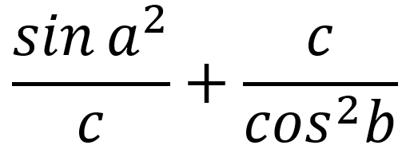

## Значение выражения
Найдите значение выражения:

Значения a, b и с вводятся с клавиатуры в одной строке, и имеют целый тип

<table style="width: auto; margin: auto">
    <tr style="text-align: center">
        <th><b><i>Формат ввода</i></b></th>
        <th><b><i>Формат вывода</i></b></th>
    </tr>
    <tr style="vertical-align: top">
        <td>Три целых числа</td>
        <td style="vertical-align: top">Одно вещественное число с точностью до 3 знаков после запятой</td>
    </tr>
</table>

### Пример
<table style="width: auto; margin: auto">
    <tr style="text-align: center">
        <th><b><i>Ввод</i></b></th>
        <th><b><i>Вывод</i></b></th>
    </tr>
    <tr style="vertical-align: top">
        <td>35 5 13</td>
        <td>161.546</td>
    </tr>
</table>