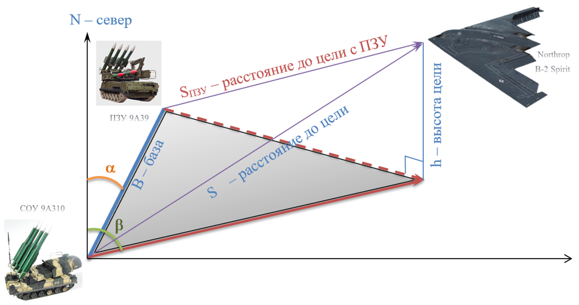

## Триангуляция в пространстве
Составьте алгоритм и программу для нахождения расстояния до цели (SПЗУ) в пространстве. 
Входными данными считать азимут с СОУ на ПЗУ (α), азимут с СОУ на Цель (β), расстояние между СОУ и ПЗУ (В – база) и расстояние с СОУ до Цели (S), 
а также высота цели (h). Учитывать, что азимут может быть больше 180o <b>не</b> нужно.

<table style="width: auto; margin: auto">
    <tr style="text-align: center">
        <th><b><i>Формат ввода</i></b></th>
        <th><b><i>Формат вывода</i></b></th>
    </tr>
    <tr style="vertical-align: top">
        <td>Пять строк данных:  1 - база в метрах (B)   2 - расстояние с СОУ до Цели в метрах (S)
          3 - азимут с СОУ на ПЗУ (α)   4 - азимут с СОУ на Цель (β)   5 - высота цели в метрах (h)
  </td>
        <td style="vertical-align: top">Расстояние с ПЗУ до Цели в метрах,  с точностью до двух знаков после запятой</td>
    </tr>
</table>

### Пример
<table style="width: auto; margin: auto">
    <tr style="text-align: center">
        <th><b><i>Ввод</i></b></th>
        <th><b><i>Вывод</i></b></th>
    </tr>
    <tr style="vertical-align: top">
        <td>500 45_000 5 88 12_000</td>
        <td>44944.01</td>
    </tr>
</table>