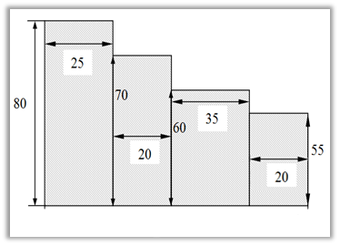

## Функции: Площадь прямоугольника

Разработать функцию, которая вычисляет площадь прямоугольника по двум сторонам. Используя эту функцию, найдите
площадь заштрихованной фигуры. Известные величины, отмеченные на чертеже, вводятся с клавиатуры. Количество
прямоугольников известно заранее.

<table style="width: auto; margin: auto">
    <tr style="text-align: center">
        <th><b><i>Формат ввода</i></b></th>
        <th><b><i>Формат вывода</i></b></th>
    </tr>
    <tr style="vertical-align: top">
        <td>В первой строке количество прямоугольников. Далее строки со сторонами прямоугольников</td>
        <td style="vertical-align: top">Одно число - площадь</td>
    </tr>
</table>

### Пример

<table style="width: auto; margin: auto"> 
    <tr style="text-align: center">
        <th><b><i>Входные данные</i></b></th>
        <th><b><i>Выходные данные</i></b></th>
    </tr>
    <tr style="vertical-align: top">
        <td style="vertical-align: top" >4 25 80 20 70 35 60 55 20</td>
        <td style="vertical-align: top">6600</td>
    </tr>
</table>