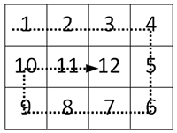

## Матрица: змейка по периметру
Заполните матрицу, содержащую __n__ строк и __m__ столбцов, натуральными числами по спирали и змейкой, как на рисунке

<table style="width: auto; margin: auto">
    <tr style="text-align: center">
        <th><b><i>Формат ввода</i></b></th>
        <th><b><i>Формат вывода</i></b></th>
    </tr>
    <tr style="vertical-align: top">
        <td>Два целых числа через пробел</td>
        <td style="vertical-align: top">Матрица</td>
    </tr>
</table>

* Используйте форматный вывод для выравнивания элементов по правому краю, для дополнения используйте пробел.