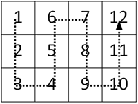

## Матрица: змейка перпендикулярно
Заполните матрицу, содержащую <b>n</b> строк и <b>m</b> столбцов, натуральными числами по спирали и змейкой, как на рисунке
<table style="width: auto; margin: auto">
    <tr style="text-align: center">
        <th><b><i>Формат ввода</i></b></th>
        <th><b><i>Формат вывода</i></b></th>
    </tr>
    <tr style="vertical-align: top">
        <td>Два целых числа через пробел: <b>n</b> и <b>m</b></td>
        <td style="vertical-align: top">Матрица размером n*m</td>
    </tr>
</table>

* Используйте форматный вывод для выравнивания элементов по правому краю, для дополнения используйте пробел.
